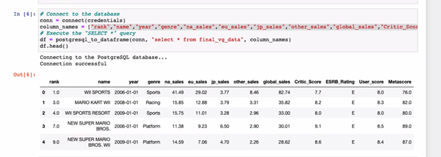
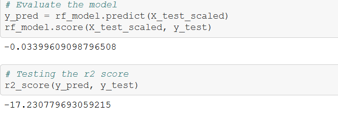
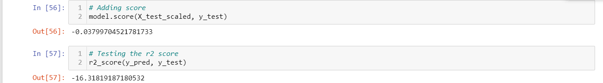
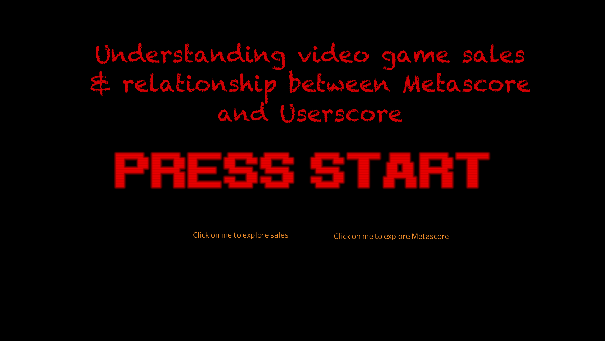

# final_project_test
UT McCombs Data Visualization Boot Camp Group Project

Image Source: Guinnessworldrecords

## Quick Select in Order of Workflow
[Technologies](technology.md)

[All Starter Files](Resources/1.Starter_Files)

[Cleaning Data Sources](Resources/Cleaning_data_sources.ipynb)

[All Cleaned Files](Resources/2.Cleaned_Files)

[Final SQL](final_sql.sql)

[Entity Relationship Diagram](https://www.quickdatabasediagrams.com/)

[Final Video Game CSV](Resources/final_vg_data.csv)

[Final Machine Learning File](Resources/Machine_Learning_Model_final.ipynb)

[Presentation](https://rb.gy/nbalj3)

[Speaker Notes](Speaker_Notes.txt)

[Dashboard](https://public.tableau.com/profile/andrew.nuss#!/vizhome/UT_Austin_VG_Dashboard_Final/LandingPage)

[All Rejected Files](Resources/3.Rejected_Files)

## Topic Selection
In selecting a topic, the team wanted to pick a dataset that represented a common interest amongst each team member.  To varying degrees, each team member is interested in the video game industry, which has many aspects to explore such as sales, genres, platforms, rankings, and ratings.  In particular, the video game industry is on track to hit $138 billion in revenue in 2021 according to J. Clement.  With this much revenue, there is a wealth of data to be mined within the video game industry.  

## Investigative Questions and Data Sources
The investigating question is to determine the main drivers behind video game sales.  The starting dataset was sourced from Kaggle, which ultimately was came from VgChartz.com and Metacritic.com.  From running machine learning code, the team hopes to answer the following questions.

1. What is the main driver behind North American sales? Genre, ESRB Rating?
2. Does the Metascore predict higher North American sales? 
3. What is the correlation between User Scores and the MetaScores? 

## Methodology and Technologies Used 
Visual Studio Code was used to clean or compare python scripts as needed and was used to update the markdown. Python scripts and multiple libraries were used in Jupyter Notebook to clean and analyze the dataset. Specifically, the Pandas library was used to clean the dataset. After the data files were cleaned, they were imported into Postgres using SQL, and then combined with SQL joins.  The appropriate password and config files were added for Jpyter Notebook to access the Postgres database.  Using several libraries, basic linear regressions were the initial machine learning models to gain insights.

To summarize the findings, the joined dataset was exported from PgAmin and imported into Tableau Public. Using an entity relationship diagram [website](https://www.quickdatabasediagrams.com/), the ERD shows the dataset columns and how the joins were made. The final outputs have an interactive display on [Tableau Public](https://public.tableau.com/profile/andrew.nuss#!/vizhome/UT_Austin_VG_Dashboard_Final/LandingPage) and is communicated through [Google Slides](https://rb.gy/nbalj3).   

## Data Exploration 
### Cleaned DataFrame
About six files were explored and [cleaned](Resources/2.Cleaned_Files) in jupyter notebook before reaching the the three final files ready to be merged.  Three of the files were [rejected](Resources/3.Rejected_Files) after dropping NaN values and leaving an insufficient amount of data to analyze. After running into issues while attempitng to import the files using [pgadmin](final_sql.sql), three files were deemed suitable for machine learning [analysis](Resources/final_vg_data.csv).

To prevent potential bias, duplicate names were dropped. To make the joins successful, the name columns were made as all uppercased letters.  After the final cleaning of the files. Next, two left joins on the files were done using SQL to create a final file, leaving about 1400 rows of clean and useful data.

## Machine Learning
### Preprocessing and Feature Selection
The Genre and ESRB ratings columns were converted to the categorical column with the get_dummies() function. Using the get_dummies() function converts each unique data point into a separate column with either a 0 or 1 indicators. The Metascore data was then divided by 10 to be in the same scale with the critic score and user score. 

### Simple statistical analysis
- View global sales across regional sales
- View how critic and user score might impact sales
- A pairplot was created using the seaborn library to show the correlation of each columns. 

### Model Choice
The desired output for the model was a number, making a regression model the best fit. After exploring several linear regression models based on different variables, the two models that gave the most interesting results are listed below. In the early phase, linear regression was a quick way to test different variables against each other. Using a more complex machine learning model, the next model explored was the Random Forest Regressor and XGBoost.

### Splitting the Data
In the linear regression models, the x and y variables were split into training and testing sets.  Metascore was the x for two of the linear regression models and crossed it against the y variables represented by the North American Sales for the first one and Userscore for the second one.  For the Random Forest Regressor and the XGBoost models, x and y were split into training and testing sets. The x variable used these columns: E, E10, M, RP, T, Action, Adventure, Fighting, Misc, Platform, Puzzle, Racing, Role-Playing, Shooter, Simulation, Sports, and Strategy. The y variable used NA Sales to determine if the genres and ESRB ratings changed sales in the highest grossing region. 

A linear regression model was created to show the Metascore into Plot Scatter.

### Limitations and Benefits
Using linear regression has a limitation of comparing two variables. In an early analysis, the benefit of linear regression is quickly comparing relationships between two variables. The benefit of using the random forest regressor is it allows to analyze more variables. However, the time it takes to dial in on the optimization of the model is the main limiting factor.  XGBoost has an efficient algorithm, but it requires a stronger math background needed to interpret the results. 

## Results
### Metascore vs NA Sales Linear Regression
For the mean squared error, numbers closer to zero represent a good model. For the variance score, numbers closer to one is a good model. Depending on the dataset, variance scores between 0,7 and 1.0 are considered good numbers for a model. For Metascore vs NA Sales, 6.05 is too high for a mean squared error and .03 is significantly low for a variance score.

### Metascore vs Userscore Linear Regression

For the second linear regression model comparing the Metascore and the Userscore, the scores were improved, but would not be accepted as a good model due to the low variance.  

### Random Forest Regressor
For the Random Forest Regressor, the data was split into X and y, then X_train, y_train, X_test, and y_test. The genre dummies and esrb rating dummies were used to test if they made an impact on NA Sales. The data looked best using a n estimator of 10, which is not a strong number of iterations to rigorously test the data.  The results of n = 100 are shown below. 

### XGBoost 
Using the same variables for the training and testing as the Random Forest Regressor, XGBoost showed little improvement in the model.

### Future Models to Explore
To build a more predictive model for video game sales, we would switch out ESRB Ratings and Genre with budget or development cycle.  Additional columns of data are needed to explore other factors that contribute to NA Sales. Regression was the main focus of this analysis, but with additional columns of data, then using machine learning models focused on decision trees could be explored. 

## Dashboard

For our [dashboard](https://public.tableau.com/profile/andrew.nuss#!/vizhome/UT_Austin_VG_Dashboard_Final_4112021/LandingPage), we incorporated a design/theme to the tool. We designed it for video game developers to use and gain insight on (1) Understanding trend video game sales across different region and if ESRB or Genre have an correlation to Sales (2) What is the correlation to User and Metascore. While using the tool, there is a variety of functionality/interactions available for the user. The user can choose to navigate to either the 'Sales' tab or 'Metascore' tab to begin using the dashboard.

### Sales Tab
In the Sales tab, users can use the 'Region' filter to view respective video game sales trends for that specific region. 

One of our key questions in this analysis was looking to evaluate if ESRB or Genre were top drivers in North American Sales. Below is a heatmap of Genre and ESRB ratings with North American sales. As you can see, there appears to be no strong relationship or indication that either drive North American sales. However, it's interesting to note that 'Racing' genre games rated 'E' appear to be the most successful category of game sold in North America.

### Metascore Tab
Once users have navigated to the Metascore tab, they can see a variety of views such as the top genre by Metascore, what are the top 'N' games by metascore and Sales, and understanding the relationship between Userscore and Metascore. The last visual is addressing one of our key questions around understanding the correlation between Userscore and Metascore. Based on the visual, there is a positive correlation between Metascore and Userscore. Meaning, as Metascore rises, Userscore follows a similar pattern.

## Recommendations
Looking at the accuracy of the models, the linear regression models had good mean squared error but a poor variance score. Because looking at two variables is limiting, using the random forest regressor and XGBoost added in ESRB rating and Genre expanded the model. Due to the low accuracy of the random forest model and XGBoost, it is recommended to add more columns such as: budget for games, developement time, and number of QA testing. In the data cleaning phase, more columns of data would allow for more experimenting, like dropping columns which could greatly improve accuarcy.
